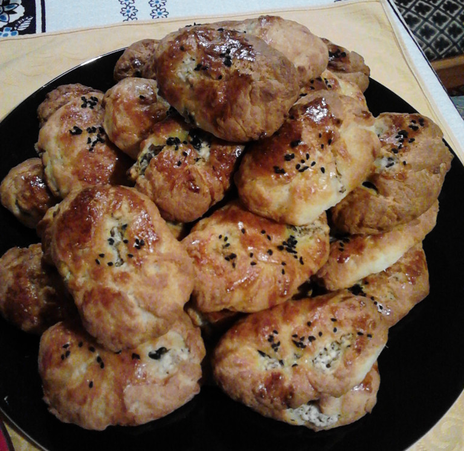

# Poaca

Quelle: http://www.chefkoch.de/rezepte/709461173539802/Poaca.html

## Zutaten

für ca. 20 Stück:

* 200g Joghurt
* 150g Öl
* 2 Eiweiß
* 1 Pck. Backpulver
* 350g Mehl
* 150g Schafskäse (Abtropfgewicht)
* Oliven
* Eigelb zum Bestreichen
* Schwarzkümmel

## Zubereitung

Joghurt und Öl verrühren, Eiweiß und Salz dazu. Das Mehl mit Backpulver
vermischen, zu der Joghurt-Öl-Masse geben und alles miteinander verrühren.  Der
Teig sollte sich anfühlen wie ein Ohrläppchen (so sagt man das in der Türkei).

Für die Füllung Schafskäse zerbröseln und mit kleingeschnittenen Oliven
mischen.  Aus dem Teig eine Kugel formen und plattdrücken, mit einem Teelöffel
die Füllung draufgeben.  Vorsichtig schließen und zu einer Kugel formen. Diese
werden auf ein mit Backpapier ausgeletes Backblech gelegt. Mit dem Eigelb
bestreichen und dem Schwarzkümmel bestreuen.

Im vorgeheizten Backofen bei 200°C so lange backen, bis sie eine schöne Bräune
haben.
